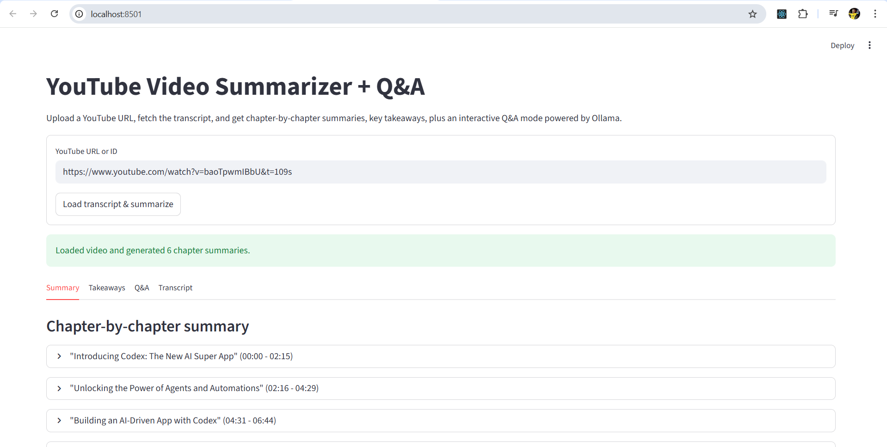
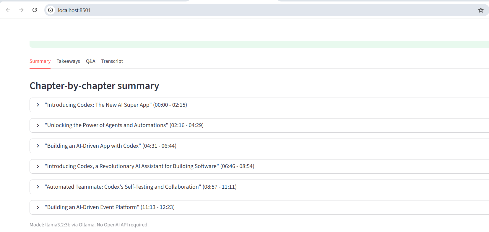

# YouTube Video Summarizer + Q&A

A Streamlit app that converts a YouTube URL into chapter-by-chapter summaries, key takeaways, and an interactive Q&A assistant. It runs fully local with Ollama, so there are no API costs.

## Project Structure

```text
README.md              # This file
requirements.txt       # Python dependencies
streamlit_app.py       # Streamlit UI layer
video_summarizer.py    # Core pipeline: transcript extraction, chunking, summarization, Q&A
```

## Screenshots




## Tech Stack

- `youtube-transcript-api` - free transcript extraction, no YouTube API key required
- `llama3.2:3b` via Ollama - local LLM for summarization and Q&A
- `nomic-embed-text` via Ollama - local embeddings for semantic chunk retrieval
- `numpy` - cosine similarity scoring
- Streamlit - UI layer

---

## Architecture & Design Decisions

### Pipeline overview

```text
YouTube URL
  -> extract_video_id()       # URL parsing for full URLs, shorts, embeds, short links, and raw IDs
  -> load_transcript()        # youtube-transcript-api, English variants with graceful error handling
  -> chunk_transcript()       # character-budget chunking, preserves timestamps
  -> summarize_transcript()   # per-chunk LLM call for title + summary
  -> build_chunk_embeddings() # cached once per loaded video for faster Q&A
  -> build_takeaways()        # takeaways + suggested questions from chapter summaries
  -> Streamlit UI             # tabs: Summary / Takeaways / Q&A / Transcript

On user question:
  -> select_context_chunks()  # semantic retrieval using cached chunk embeddings
  -> answer_question()        # grounded answer from top-k transcript chunks + chapter summaries
```

### Key design decisions

**Character-budget chunking over token counting**

Chunking uses a `max_chars=2800` budget rather than token counting. This avoids a tokenizer dependency while staying well within `llama3.2:3b`'s context window. The tradeoff is slight imprecision at chunk boundaries, which is acceptable for this summarization task.

**Per-chunk summarization, not full-transcript summarization**

The transcript is summarized chunk-by-chunk instead of feeding the full transcript in one shot. This handles longer videos without hitting context limits and produces chapter-level granularity that maps naturally to how people navigate video content.

**Cached semantic retrieval for Q&A**

Q&A retrieval uses `nomic-embed-text` embeddings and cosine similarity instead of keyword overlap. Chunk embeddings are built once after loading a video and reused for every question, so follow-up questions only need one new query embedding before answer generation.

**Two-stage context for Q&A**

`answer_question()` passes both the top-k raw transcript chunks and the chapter summaries to the LLM. Raw chunks give precise grounded context, while chapter summaries provide broader video-level context for questions that span multiple sections.

**No FAISS for single-video use**

This project deliberately omits FAISS because the scope is a single video per session. In-memory cosine similarity over typical video chunks is enough here. For a multi-video library, FAISS or a vector database would be the right addition.

**Ollama REST API over subprocess**

LLM calls use `requests.post` to Ollama's local REST API rather than shelling out. This gives structured JSON responses, timeout control, and cleaner error propagation.

### Known limitations

- **No auto-caption fallback** - if English transcripts are unavailable, the app errors rather than falling back to auto-generated captions.
- **Video title not fetched** - the app uses the video ID as an internal identifier. Fetching the actual title would require the YouTube Data API or HTML scraping.
- **Sequential chunk summarization** - chapters are summarized one at a time. Parallelizing with `concurrent.futures` would reduce load time for long videos.

---

## How It Works

1. Extract the YouTube video ID from the URL.
2. Pull the transcript from YouTube.
3. Split the transcript into character-budget chunks with timestamps preserved.
4. Summarize each chunk independently via Ollama to generate chapter titles and summaries.
5. Cache one embedding per transcript chunk for faster Q&A.
6. Run a second LLM pass over all chapter summaries to extract key takeaways and suggested questions.
7. On user questions, embed the query, score it against cached chunk embeddings, retrieve top-k chunks, and generate a grounded answer.

## Run Locally

1. Activate the project virtual environment:

   ```powershell
   .venv\Scripts\Activate.ps1
   ```

2. Install dependencies:

   ```powershell
   pip install -r requirements.txt
   ```

3. Start the app:

   ```powershell
   streamlit run streamlit_app.py
   ```

4. Open in browser:

   ```text
   http://localhost:8501
   ```

## Ollama Setup

Ensure Ollama is installed and both models are available:

```powershell
ollama list
```

If missing, pull them:

```powershell
ollama pull llama3.2:3b
ollama pull nomic-embed-text
```

The app calls Ollama at `http://localhost:11434`.

## Notes

- No OpenAI API key required - fully local inference.
- Designed for single-video sessions; no persistent vector store.
- For multi-video or library-scale use, FAISS indexing would be the natural extension.
